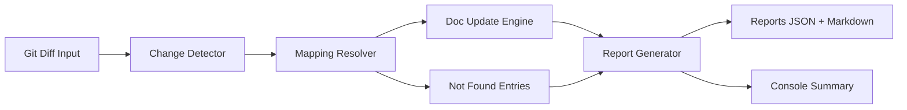

# Architecture: Automated Documentation Sync

## 1. Architecture Summary
The solution introduces a documentation sync engine that reads git diffs, maps code changes to documentation targets, updates markdown sections safely, and emits verification reports for local and CI workflows.

## 2. High-Level Components
- Change Detector: Collects changed files from git diff.
- Mapping Resolver: Converts changed paths into doc targets using config rules.
- Doc Update Engine: Applies bounded updates to markdown sections.
- Report Generator: Creates JSON + Markdown summaries including `Not Found`.
- CLI Orchestrator: Exposes command flags (`--dry-run`, `--base`, `--head`).
- CI Hook: Runs sync and uploads artifacts.

## 3. Component Responsibilities
- Change Detector
  - Resolve diff scope (staged, unstaged, branch range).
  - Normalize file paths.
- Mapping Resolver
  - Parse mapping config.
  - Match path patterns.
  - Return target docs and section anchors.
- Doc Update Engine
  - Read target markdown.
  - Update only bounded sections.
  - Preserve formatting outside targeted blocks.
- Report Generator
  - Build structured status per changed file: Updated, Not Found, Skipped, Error.
  - Save summary and details.
- CLI Orchestrator
  - Validate arguments and config.
  - Coordinate pipeline and exit codes.
- CI Hook
  - Execute command on PR events.
  - Publish report artifacts.

## 4. Data Flow


## 5. Technology Choices
- Language: Python (fits existing Django repo and test setup).
- Parsing: Markdown section update via anchor markers.
- Config: YAML/JSON mapping file.
- Execution: Python CLI command invoked from PowerShell and CI.
- Testing: Pytest unit + integration tests.

## 6. Interfaces
- Input config file example:
```yaml
mappings:
  - source: emp/views.py
    target: README.md
    section: "## 3. New Features Implemented"
```

- CLI example:
```bash
python -m tools.doc_sync --base origin/main --head HEAD --dry-run
```

## 7. Error Handling Strategy
- Missing config: fail fast with clear message.
- Missing target section: report `Not Found`, continue pipeline.
- Unreadable file: report error and mark run failed.

## 8. Security Considerations
- Never read secret files outside repo scope.
- Redact token-like values if discovered in generated content.
- Restrict updates to configured markdown targets only.

## 9. Scalability and Limits
- Designed for small-to-medium repositories.
- For large diffs, process in batches and stream logs.
